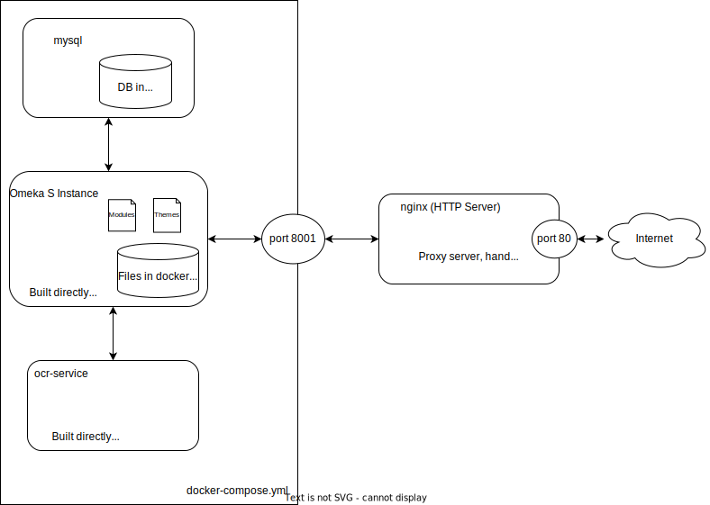

# Digital Archive

This is code to easily deploy an Omeka S instance and an automatic OCR service which periodically process uploaded PDFs.



## Pre-requisites

- Docker install (for instance for Ubuntu https://docs.docker.com/engine/install/ubuntu/)
- Docker-compose install (see https://docs.docker.com/compose/install/)
- nginx installed (`sudo apt install nginx` or equivalent)

## Initial Configuration

### Create `env_variables`

The `env_variables` file (used eventually by the ocr-service) has to be created first, so just run `cp env_variables.example env_variables`.

### Start Omeka S

Assuming docker-compose is properly installed, just run `docker-compose up -d --build omeka db` in this folder to start the Omeka S instance.

The Omeka S instance is then accessible locally on port 8001.

#### Nginx configuration

In order for the port 8001 to be accessible from the outside, one should modify the `nginx` configuration by modifying the corresponding part of the `/etc/nginx/sites-available/default` file with the following snippet
```
location / {
        proxy_pass_header Server;
        proxy_set_header X-Real-IP $remote_addr;
        proxy_set_header X-Scheme $scheme;
        proxy_set_header X-Forwarded-For $proxy_add_x_forwarded_for;
        proxy_set_header X-Forwarded-Proto $scheme;
        proxy_set_header Host $http_host;
        proxy_redirect off;

        proxy_pass http://127.0.0.1:8001;
        # Max file upload size
        client_max_body_size 600M;
}
```

Then restart the nginx server with `sudo service nginx restart`, the Omeka S instance should now be accessible from the outside world directly.

NB: for https configuration, the following process can be followed https://certbot.eff.org/instructions?ws=nginx&os=ubuntufocal

### Add Ontology Terms

In the admin panel -> Vocabularies -> Import new vocabulary.

For the form do as follow:
- Label: Sabil Ontology
- Namespace URI: `http://sabil.ethz.ch/ns/terms/`
- Namespace prefix: `sabil`
- Vocabulary file: `sabil_ontology.ttl` (present at the root of this repository)

### Create the OCR Service

- In the admin page of Omeka S, create a new user (set it as active) with edition access (Editor or above)
- In the "Edit User" page of this user, create an API Key.
- In the `env_variables` file in this folder (created from the template `env_variables.example`), and specify the API credentials with the values obtained at the previous step (`key_identity` and `key_credential`)
- Build and start the OCR service `docker-compose up -d --build ocr-service`

Looking at the logs of the ocr-service can be done with `docker-compose logs -f ocr-service`

## OCR Bot Behaviour

See the corresponding [README.md](ocr_service) in the `ocr` folder.

## Other tasks

### Logging

Printing latest logs of Omeka-S can be done with `docker-compose exec -T omeka tail -f logs/application.log`.

Prining logs of the `ocr-service` : `docker-compose logs -f ocr-service`.

### Backups

#### Database backups

The most important backup is the database data, which includes all metadata, user, configuration information of the Omeka S instance.

- Do a dump of the current state of the database: `docker-compose exec db /bin/bash -c "/usr/bin/mysqldump -u root --password=rootpass omeka-s 2> /dev/null" | gzip > backup_$(date +"%Y-%m-%d_%H_%M_%S").sql.gz`
- Restore the database to a specific dump file : `gunzip < "backup_<DATE-OF-THE-BACKUP-FILE>.sql.gz" | docker-compose exec -T db /usr/bin/mysql -u root --password=rootpass omeka-s`

#### File backups

Files are stored in a docker volume associated with the Omeka container. Indeed, all medias (original files, thumbnails, processed pages, etc...) are stored together in the `files` docker volume. This volume can be backed up and restored by running the following commands, substituting the placeholder for the name of the Omeka docker container (which can be found with `docker ps -a`):

- Store volume data in a compressed tar ball: `docker run --rm --volumes-from NAME_OF_OMEKA_CONTAINER -v $(pwd):/backup busybox tar czvf /backup/backup.tar.gz /var/www/html/files`
- Extract file to volume of new Omeka container: `docker run --rm --volumes-from NAME_OF_NEW_OMEKA_CONTAINER -v $(pwd):/backup:Z busybox /bin/sh -c "cd / && tar xzvf /backup/backup.tar.gz --strip 1"`

Since all server files are backed up by ETH, if some original media file is deleted by mistake, asking ETH IT to perform a rollback to a previous state would be the easiest way to restore it.

### Configure max upload size for file

Max Upload size has to be changed in two locations:
- in `.htaccess` in `omeka_docker` before rebuilding (`upload_max_filesize` and `post_max_size`)
- in the nginx configuration in `/etc/nginx/sites-available/default` (`client_max_body_size`)

### Add modules in Omeka S

Modules have to be downloaded in `omeka_docker/modules` before building/starting the docker services. For instance, one can run the following commands for some module examples
```
# Go to the proper directory
cd omeka_docker/modules

wget https://github.com/omeka-s-modules/Collecting/releases/download/v1.6.1/Collecting-1.6.1.zip
unzip Collecting-1.6.1.zip

wget https://github.com/omeka-s-modules/ValueSuggest/releases/download/v1.8.0/ValueSuggest-1.8.0.zip
unzip ValueSuggest-1.8.0.zip

wget https://github.com/zerocrates/PdfEmbedS/releases/download/v1.2.0/PdfEmbed-1.2.0.zip
unzip PdfEmbed-1.2.0.zip

wget https://github.com/omeka-s-modules/CustomVocab/releases/download/v1.5.0/CustomVocab-1.5.0.zip
unzip CustomVocab-1.5.0.zip
rm CustomVocab-1.5.0.zip
```

After adding new modules, one should restart the services with the usual `docker-compose up -d --build` from the main directory.

### Search module (experimental)

Use the modules
```
wget https://github.com/biblibre/omeka-s-module-Search/releases/download/v0.9.0/Search-0.9.0.zip
unzip Search-0.9.0.zip
rm Search-0.9.0.zip
wget https://github.com/biblibre/omeka-s-module-Solr/releases/download/v0.9.0/Solr-0.9.0.zip
unzip Solr-0.9.0.zip
rm Solr-0.9.0.zip
```

`docker exec digital-archive_solr_1 bin/solr create_core -c omeka-s` to initialize solr core

Set `solr:8983/solr/omeka-s` for the url of the solr core in the configuration
